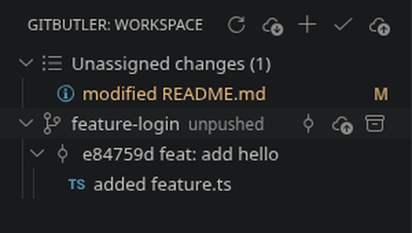
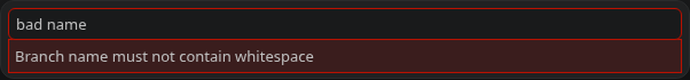

# GitButler for VSCode

The VSCode extension (`vscode/`) brings the GitButler workspace into VS Code, powered by
the same `:core` logic as the JetBrains plugin — compiled to JavaScript (Kotlin/JS) and
bundled into the extension. All GitButler operations shell out to the `but` CLI with
`--json`, exactly like the JetBrains plugin.

## Where to find it

The extension contributes a **GitButler** view container on the activity bar with a
**gitbutlerWorkspace** tree view. When the open folder isn't checked out on
`gitbutler/workspace`, the tree shows a single **"Not a GitButler workspace"** row.

## The tree

Mirrors `but status`:

- **Unassigned changes** — uncommitted changes not assigned to any stack (computed as the
  set difference, by change id, between all uncommitted changes and every stack's assigned
  changes).
- **`<branch name>`** — one node per applied virtual branch (context value `branch`).
- **Commits** — each commit under its branch, expandable into the files it changed.
- **Assigned changes** — the changes staged to a stack.

## Commands

| Command | ID | What it runs |
|---|---|---|
| Refresh | `gitbutler.refresh` | Re-reads `but status` and repaints the tree |
| Pull Workspace | `gitbutler.pull` | `but pull` |
| New Virtual Branch | `gitbutler.newBranch` | `but branch new <name>` — adds an empty virtual branch to the workspace |
| Push Branch | `gitbutler.push` | `but push <branch>` (the selected branch row, else a quick-pick) |
| Commit to Branch | `gitbutler.commitToBranch` | `but commit -b <branch>` to the branch the row belongs to — no branch prompt |
| Apply Branch | `gitbutler.apply` | `but apply <branch>` (branch name via input box) |
| Unapply Branch | `gitbutler.unapply` | `but unapply <branch>` |
| Commit to virtual branch | `gitbutler.commit` | `but commit -b <branch> -m <message> <ids>` (quick-pick branch + files, input message) |
| Commit Selected Changes | `gitbutler.commitSelected` | Commits the files currently selected in the tree (`but commit`); prompts for branch + message |
| Rename Commit | `gitbutler.reword` | `but reword <commit> -m <message>` |
| Uncommit / Uncommit File | `gitbutler.uncommit` / `gitbutler.uncommitFile` | `but uncommit <id>` |
| Select Virtual Branch for Commits | `gitbutler.selectVirtualBranch` | Routes Source Control commits to a virtual branch (status-bar item) |
| Commit to Virtual Branch | `gitbutler.commitToVirtualBranch` | Commits the Source Control input + staged files through `but commit` |

### Where the actions live

The view's **title bar** is the toolbar: **Refresh**, **Pull Workspace**, **New Virtual
Branch**, **Commit to virtual branch**, **Push Branch**. Hovering a **branch row** reveals
inline **Commit to Branch**, **Push Branch** and **Unapply Branch** icons.



**Commit to Branch** deliberately does *not* ask which branch — it targets the row it was
invoked on (branch and commit rows both carry their branch), then quick-picks files with
everything pre-selected and asks only for a message. **Push Branch** in the title bar targets
the selected branch row, falling back to a quick-pick when nothing branch-related is selected.

The tree is multi-select: Ctrl/Shift-click (or Cmd-click) several file rows, then right-click
the selection and choose **Commit Selected Changes** to commit exactly those files.

### Creating a virtual branch

Two routes, mirroring the JetBrains plugin:

| Where | Command | When the branch is created |
|---|---|---|
| View title bar → **New Virtual Branch** | `but branch new <name>` | immediately — an empty lane to drag changes onto |
| Any branch quick-pick → **$(add) New branch…** | `but commit -b <name>` | with the commit, so cancelling creates nothing |

The second appears in every branch picker: the commit prompts and the Source Control
**Select Virtual Branch for Commits** picker. A name typed there is only remembered — the
branch appears once you commit.

Both routes validate the name as you type against git's ref-name rules
(`ButBranch.newBranchNameError` in `:core`, the same check the JetBrains plugin uses), so a
name `but` would reject is refused in the input box instead of coming back as a CLI error:



### Drag and drop

Mirrors the JetBrains plugin: drag one or more uncommitted change rows onto a **branch** to
commit them to that branch (prompts for a message), or onto a **commit** to amend them into
it (after a confirmation). `but amend` addresses the target by its GitButler change id, so
the drop resolves the commit's `cliId` before amending.

Failures surface as VS Code error toasts carrying the CLI's message; the tree refreshes
after every successful mutation.

## How it consumes `:core`

`extension.ts` imports the compiled Kotlin/JS package `gitbutler-core`
(`me.inthefield.gitbutlerforjetbrains.core.GitButlerCore`) and `await`s its methods, which
return `Promise<string>` JSON envelopes (`{ ok: true, value? }` / `{ ok: false, error }`).
The core resolves the repository (`git rev-parse`), finds the `but` binary, runs it, parses
the JSON and maps file paths — identical logic to the JetBrains plugin, shared not
reimplemented. The `but` process runs asynchronously (`child_process.execFile` bridged
through a Kotlin `suspend` function), so awaiting `pull`/`push` never blocks the extension
host.

The build bundles the core (and its Kotlin/serialization/coroutines runtime) into a single
self-contained `out/extension.js` via esbuild, so the packaged `.vsix` needs no
`node_modules` at runtime:

```bash
./gradlew :core:jsNodeProductionLibraryDistribution   # produce the JS package
cd vscode && npm run build                             # install + typecheck + bundle
```

## Known limitations

- Virtual branches with identical names across stacks are ambiguous — the CLI is invoked by
  branch name.
- New branches are always created unstacked; there is no way to stack one above or below an
  existing branch from the extension (`but branch new --above/--below` would be the hook).

## Testing

Two tiers, both against the **real** `but` CLI (mirroring the JetBrains integration suite):

### Core e2e — logic against real `but`

`test/e2e/` drives the compiled `gitbutler-core` package against a real GitButler workspace,
exercising the exact runtime path the extension uses (`GitButlerCore` → `NodeButEnvironment`
`execFile` → real `but` → parse). Two provisioning modes:

- `core.e2e.test.cjs` — uses the `but` on your `PATH`; self-skips if it is not installed.
- `core.container.e2e.test.cjs` — hermetic: builds a Docker image (Node + `but` via
  `gitbutler.com/install.sh`, the same recipe as the JetBrains image) and runs the core
  inside it; self-skips if Docker is unavailable.

```bash
cd vscode && npm run build && npm run test:e2e
```

### UI e2e — the extension in a real editor

Three interchangeable drivers open the extension in a real editor, open the GitButler
view, and assert the workspace tree renders (the "headless Chrome" layer — the editor is an
Electron/Chromium app). The Electron drivers need a display, so run under `xvfb` on headless
CI. All seed a live workspace when `but` is on `PATH`.

- **VSCodium (default in CI)** — `test/ui/codium-smoke.ts`, driven by Playwright's Electron
  API. It attaches to any Electron binary via the built-in CDP, so it runs against the
  open-source **VSCodium** build (or any VS Code) with no ChromeDriver-version matching.
  Point `CODIUM_BIN` at the real Electron binary (e.g. `/usr/share/vscodium/codium`, not the
  `bin/codium` CLI wrapper).

  ```bash
  cd vscode && npm run build
  CODIUM_BIN=/usr/share/vscodium/codium xvfb-run -a npm run test:ui:codium
  ```

- **Microsoft VS Code (optional)** — `test/ui/gitbutler-view.test.ts`, driven by
  [ExTester](https://github.com/redhat-developer/vscode-extension-tester). Richer page
  objects, but ExTester only downloads Microsoft's VS Code (it cannot target VSCodium).

  ```bash
  cd vscode && npm run build && xvfb-run -a npm run test:ui
  ```

- **Cursor (optional)** — `test/ui/cursor-smoke.ts`, driven by Playwright's Electron API like
  the VSCodium smoke. Cursor drops the classic activity bar (its unified sidebar replaces
  it), so the view is opened via the auto-generated **GitButler: Focus on Workspace View**
  command instead of an activity-bar click. It asserts the tree resolves (renders a
  GitButler-provider row) rather than spinning, but takes **no screenshot**: Cursor gates its
  workbench behind an account login, so a fresh profile shows the login welcome over the
  editor. Point `CURSOR_BIN` at the Electron binary; on macOS it defaults to the app bundle.

  ```bash
  cd vscode && npm run build
  CURSOR_BIN=/Applications/Cursor.app/Contents/MacOS/Cursor npm run test:ui:cursor
  ```

CI (`.github/workflows/ci.yml`): job `vscode` runs the core e2e; job `vscode-ui` downloads
VSCodium, runs the Playwright UI test under `xvfb`, and uploads `vscode/screenshots/` as an
artifact.
